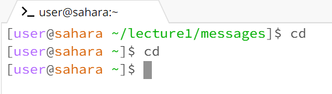
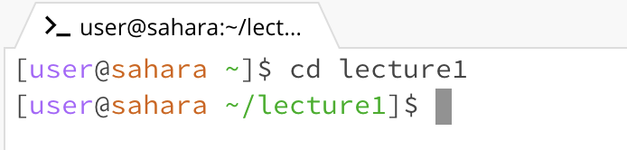
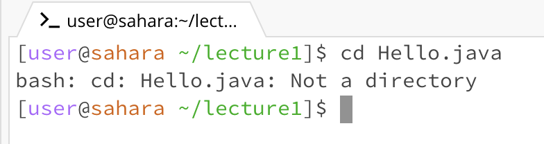
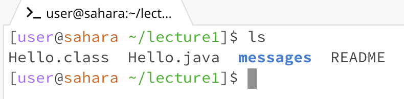
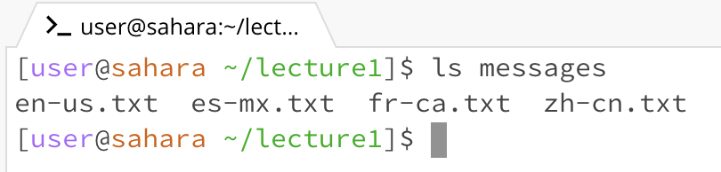
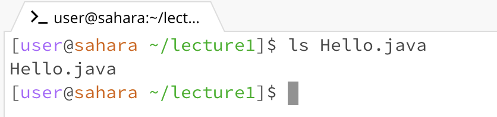
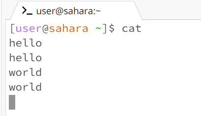
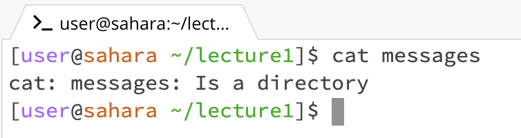
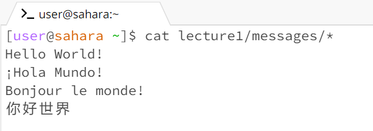
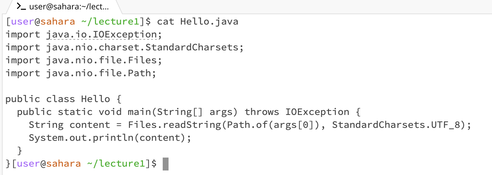

If we use cd command without any arguments, it will change the current directory to the home directory.  
If the current direcotry is the home directory, it keeps in the current direcotry.  
  

***

cd command with a path to a directroy will change current directory location to that directory.  
  

***

cd command with a path to a file will print errors because a file is not a directory.  
  

***

ls command without any arguments will print all files and folders under the current directory.  
  

***

ls command with a path to a directory will print all files under the that directory.  
  

***

ls command with a path to a file will print the file names if the file exist.  
  

***

cat command without any arguments will read the user's input and print them on the next line.
  

***

cat command with a path to a directory will print that the path is a directory.  
  

If we want to print the content of all files under the directory, we can use cat *.  
  

***

cat command with a path to a file will print the content of the file.  
  

***
