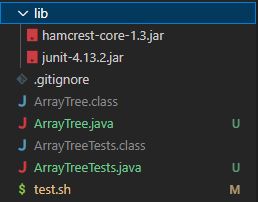
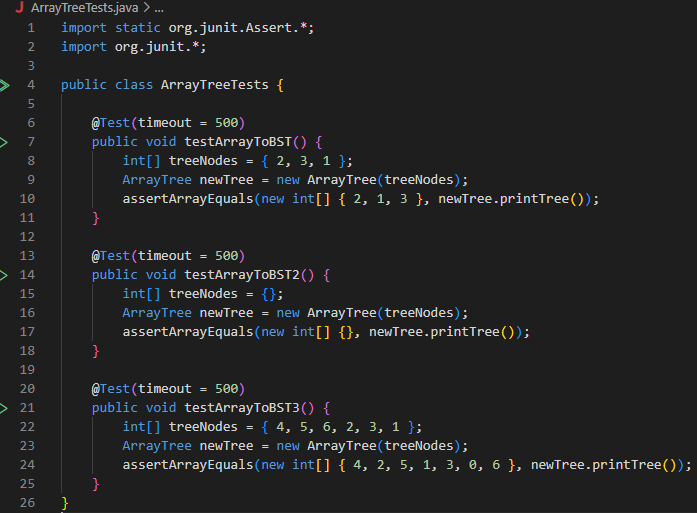
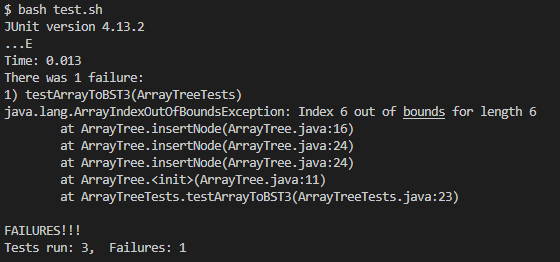
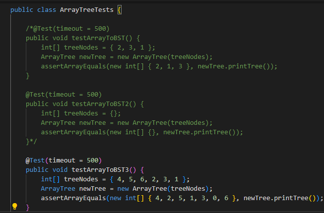
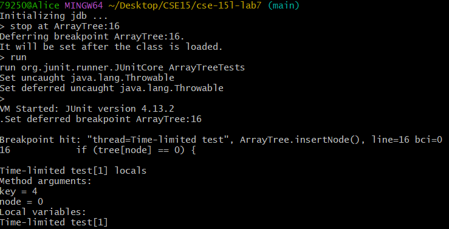
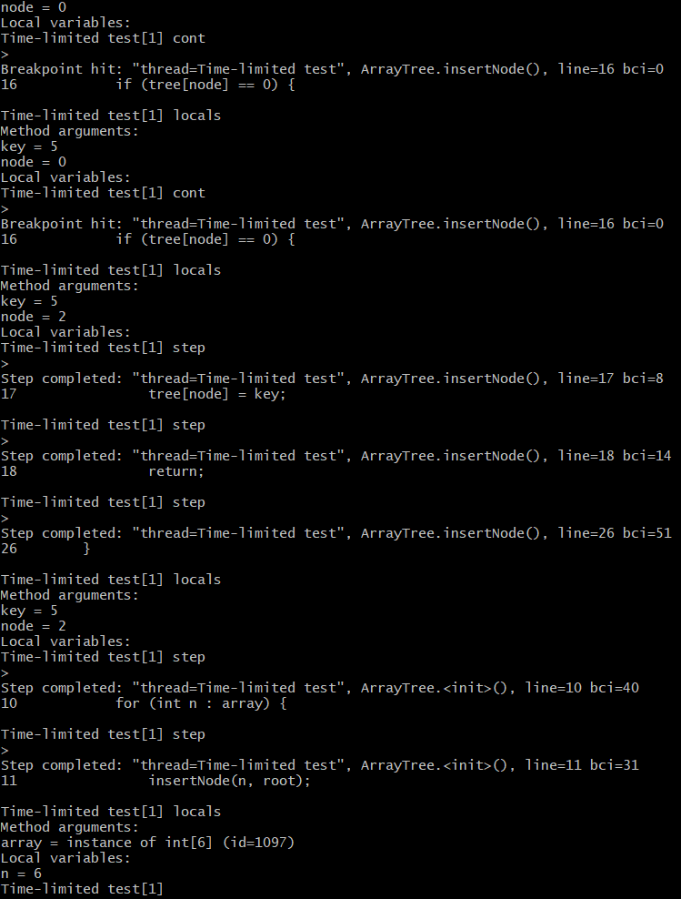
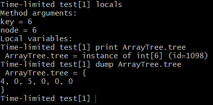
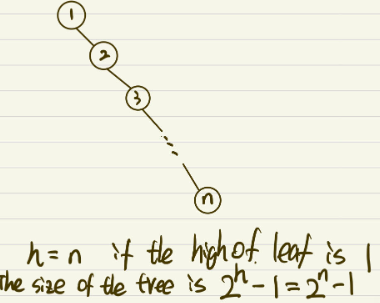
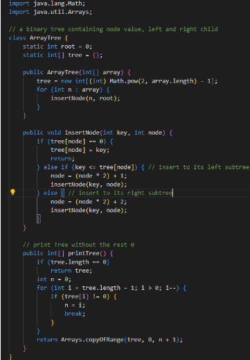
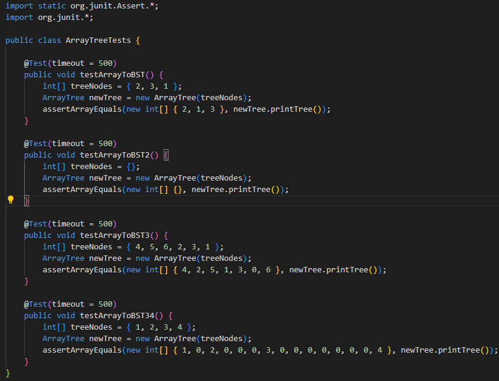

# Debugging Scenario
### Student: 
Hello, I am going to implement a binary search tree using array in java. I also tried to write a the tree structure and inserting node function in `ArrayTree.java` file and create a test.file called `ArrayTreeTests.java` to test if it work in correctly.  
According to the definition of binary tree, we can use the following method to define a binary tree in an array:  
```java
if root = array[n];
root.left = array[2 * n + 1];
root.right = array[2 * n + 2];
```
The main method takes an array as a parameter and returns a search binary tree formed from this array.  
For example,  if we input an array `[2, 3, 1]` as parameter, it will insert the node with `[2, 3, 1]` one by one in a correct place of the tree. So when we get a binary search tree, the result will return `[2, 1, 3]`. If the node value equals to `0`, which means the node is null.
```
ArrayTree newTree = ArrayTree([2, 3, 1])
newTree.printTree() // it will return a array [2, 1, 3]
```
  

`File and Directory Structure`:   
  
`ArrayTree.java`: contains the tree structor and functions  
  
`insertNode(int key, int node)`: comapred with the value with `tree[node]`, and insert a new node with value `key`.  
`printTree()`: If the tree incomplete, we delete the extra `0` from the end of the array to the last not `0` number. For example:  
```java
if the tree is [2, 1, 0]
printTree() will return [2, 1]
```  
`ArrayTreeTests.java`: contains some test functions to test if the tree is correct.  
  
`test.sh`: a script file to run the test file. 
  

### Issues

#### symptom 
It successfully pass the test 1 and 2, which means the return is correct when I input a small size array and empty array. The test3 is fail. According to the error message from terminal, I can know that the error occurs when inserting a new node to the tree in the process. The total size of the tree is 6, but the node is going to inserting to out of that bounds. I guess the bug is localed at the size of tree array, but I didn't figure it out because I thought the size of the array after forming the tree should be the same as before. I want to get some suggestion from TAs.  
Thank you!  

### TAs:
Hi, it is true that the number of actual elements in the tree is equal to the input elements in a arrays. However, what if there are empty nodes in the tree? In a tree formed by List, we can use `null` to represent an empty node, but what about in a tree formed by an array? Furthermore, in order to save space resources, please think about how large the array size should be to store a tree.

### Debug:
  
* Comment out the first two tests, then I can focus on debugging the last test.     
  
* Create a debug.sh, which help me run `jdb` debugging quickly.  
  
* `stop at ArrayTree:16`: create a breakpoint at line 16.  
* run and stop at that line.  
* `locals`: show the local variables to check the process of the function. 
  
* using `cont` and `step` command to let the program stop at the place where the error occur.
  
* `key = 6, node = 6`: the program is going to insert a value `6` to array[6]. 
* `print ArrayTree.tree`: we find that the size of the array is `6`,which mean the maximum index is `array[5]`. There is no doubt that the program get excpetion.  
* `dump ArrayTree.tree`: to show the content of the object tree. we find that there are many `0` in the array, which is the default value when creating the array.  
  
* Here's the bug code we need to fix.  

## Fixing the bug
* According to the jdb debugging, we already know that the reason of out of bounds is the number of elements in `ArrayTree` is more than that of the original array, because it needs to store `0` to represent empty nodes. So we need to adjust the size of the `ArrayTree` to prevent the index from going out of bounds. 
* In order to find the minimum ArrayTree array size, I need to know how much space the ArrayTree needs at least to store the formed tree when an array of size n is input.  
  
* When we use an array with size of n as a param, if the array is ascending order, nodes need to be inserted all the way to the right. At this time, `ArrayTree` also requires the largest capacity.  
* so when `size of input array = n`, we should have at least `2^n - 1` size to storage the `Arraytree`.  
  
* change the size to `Math.pow(2, array.length) - 1`.  

## Re-test
  
* re-run the test and get success.  

* Create a new test4 for a asending array.  The input array is `[1, 2, 3, 4]`, and it will return a tree array `[1, 0, 2, 0, 0, 0, 3, 0, 0, 0, 0, 0, 0, 0, 4]`.  
 
* Here's the tree and `0` node mean the empyty node `null`. 

### Final Test
  
* All the 4 test are correct. The bug is fixed!  

### Final file after debug
`ArrayTree.java`  
  
`ArrayTreeTests.java`  
  
`test.sh`  

`debug`    
  

# Reflection
* The grading script is most cool thing I learn from the labs. It allows me to grade other people's code just if I know their github url. The grading script will automatically complete a series of operations, like git clone, creating and copying the files, and give the students feedback. The process of writing script is also interesting. We organize the commands in a .sh file, can check the running status based on the current error code and consisder what feedback we should give. What's more surprising is that we can also run our program on a remote server.  
* Learning to use jdb to debug code is the most useful knowledge for me. I always thought that debugging on the server is very difficult, but this is not the case. At least we can use `jdb` to set breakpoints and obtain variable information.  
*  I think the `github` operations learned in this course are also very useful. Although I have used github before and understand how to push and pull code. But I have not used the issues feature. During the lab, I had the opportunity to discussed code with my teammates, and created issues with each other and made a pull request on github. I believe that these things I learned will be of great help to me in my future work.  